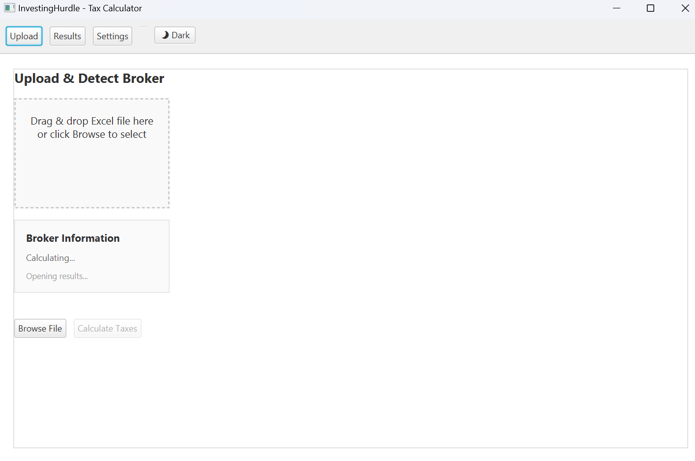
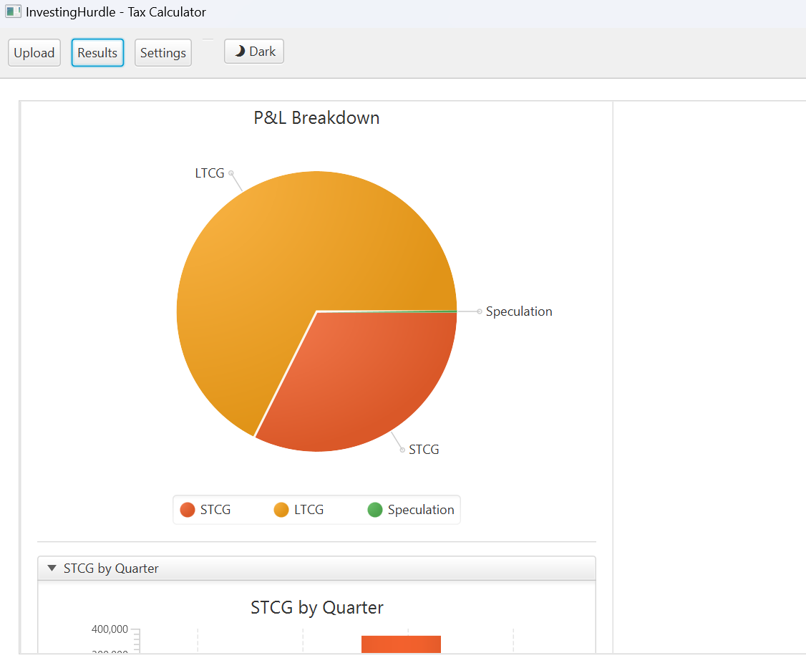
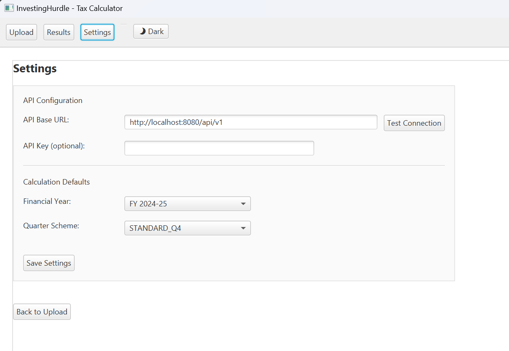
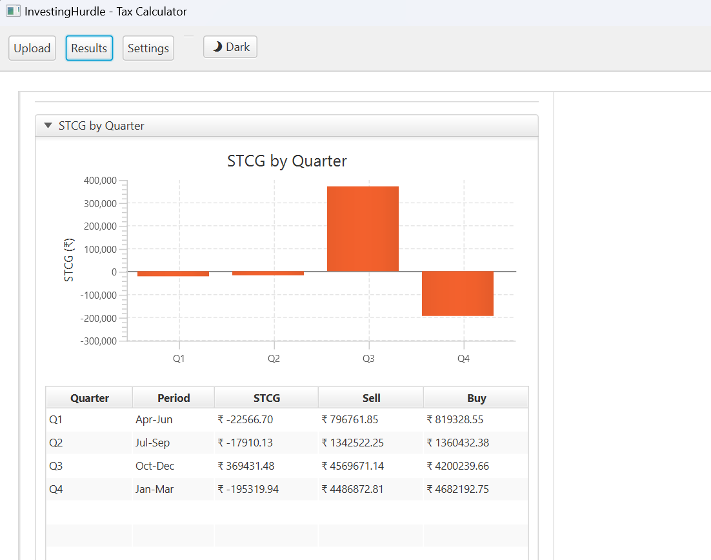
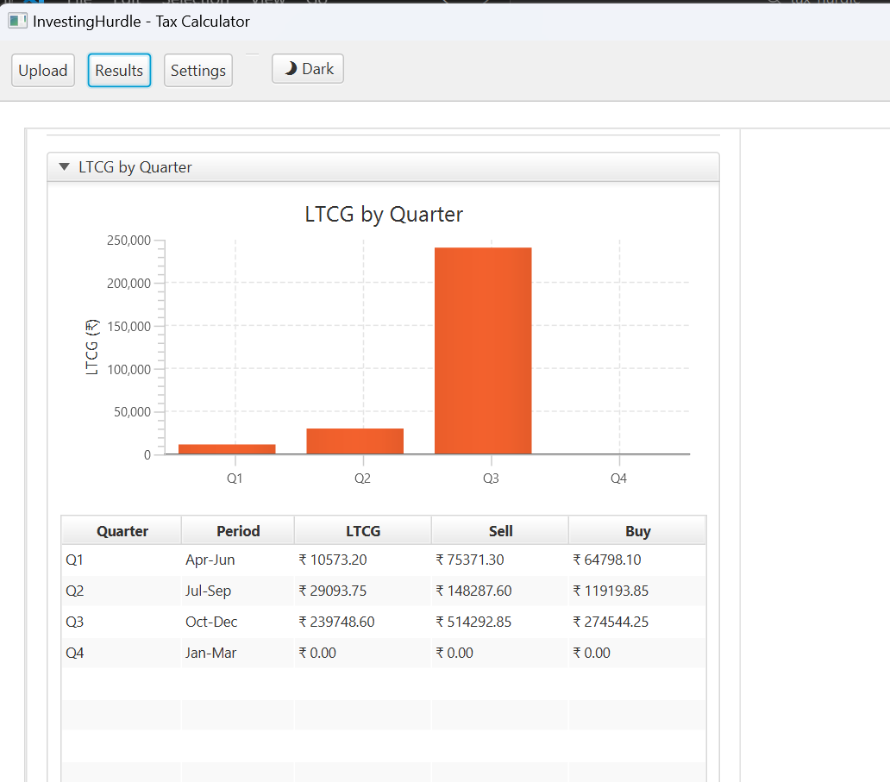
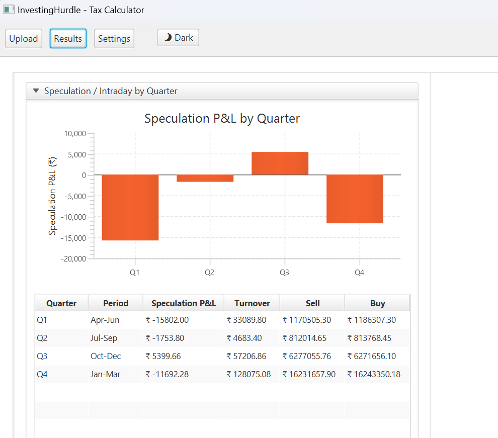
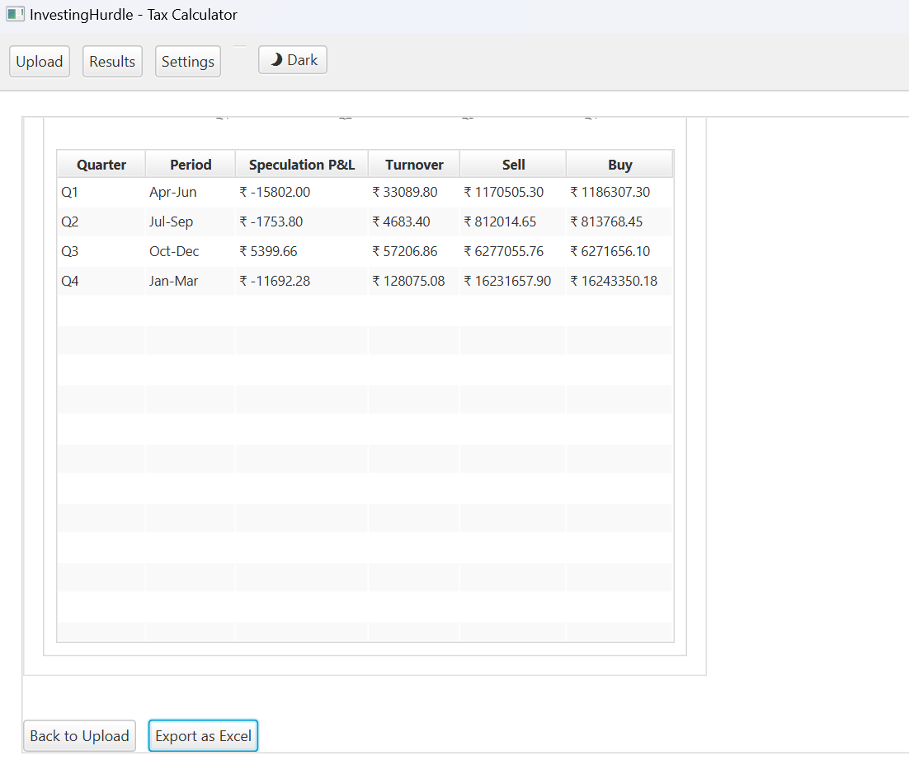

# InvestingHurdle - Tax & Capital Gains Calculator

Java tooling to calculate **STCG**, **LTCG**, and **Speculation/Intraday** results from broker Excel exports. Includes a Spring Boot REST API (with Swagger UI + Excel export) and the original console runner.

## 📋 Overview

This project now supports two flows:
- **Spring API (`spring-api/`)**: Upload broker XLSX, auto-detect mapping (Upstox, Zerodha, etc.), calculate STCG/LTCG/speculation with quarterly breakdowns, and download an Excel summary via `/calculations/export`. Swagger UI is available.
- **Legacy console (`src/` + `bin/`)**: Original CLI-style runner using the provided configuration workbook.

Key outputs:
- STCG and LTCG with quarterly breakdowns (default quarter scheme: `STANDARD_Q4`).
- Speculation (intraday) P&L and turnover (turnover uses abs(P&L)).
- Broker detection and mapping preview to diagnose column layout.

## 🏗️ Project Structure

```
InvestingHurdle/
├── src/                          # Legacy console source
│   ├── bootstrap/
│   │   └── InvestingHurdleBootstrapper.java    # Main entry point
│   ├── exception/
│   │   └── InvalidSecurityException.java        # Custom exceptions
│   ├── logging/
│   │   └── HurdleLogger.java                    # Logging utility
│   ├── params/
│   │   ├── EquityLoader.java                    # Loads equity data from Excel
│   │   └── WorkbookLoader.java                  # Workbook processing
│   ├── security/
│   │   └── Security.java                        # Security/Stock entity
│   └── util/
│       └── HurdleConstant.java                  # Application constants
├── configuration/                # Configuration files
│   ├── configuration_stock.xlsx  # Stock portfolio data
│   └── tax_2122_.xlsx           # Tax calculation data
├── lib/                          # External JAR dependencies
│   ├── log4j-api-2.20.0.jar
│   ├── log4j-core-2.20.0.jar
│   ├── poi-5.2.3.jar
│   ├── poi-ooxml-5.2.3.jar
│   ├── poi-ooxml-lite-5.2.3.jar
│   ├── xmlbeans-5.1.1.jar
│   ├── commons-collections4-4.4.jar
│   ├── commons-compress-1.21.jar
│   ├── commons-io-2.11.0.jar
│   ├── commons-math3-3.6.1.jar
│   └── SparseBitSet-1.2.jar
├── bin/                          # Compiled classes (generated)
├── .classpath                    # Eclipse/VS Code classpath config
├── .project                      # Eclipse project file
├── spring-api/                   # Spring Boot REST API with Swagger UI and Excel export
│   └── SETUP.md                  # API setup and run guide
├── javafx-ui/                    # JavaFX Desktop GUI
│   └── README.md                 # Desktop app setup and run guide
└── README.md                     # This file
```

## 🔧 Dependencies

### Core Libraries

| Library | Version | Purpose |
|---------|---------|---------|
| Apache Log4j | 2.20.0 | Logging framework |
| Apache POI | 5.2.3 | Excel file processing (XLSX) |
| XMLBeans | 5.1.1 | XML parsing (POI dependency) |
| Commons Collections | 4.4 | Enhanced collection utilities |
| Commons Compress | 1.21 | Compression utilities |
| Commons IO | 2.11.0 | I/O utilities |
| Commons Math | 3.6.1 | Mathematical utilities |
| SparseBitSet | 1.2 | Efficient bit set implementation |

### Java Requirements
- **Java Version**: Java 17+ (API and current build assume 17)

## 🚀 Getting Started

### Prerequisites

1. **Java Development Kit (JDK)** - Version 17+ (use Adoptium/Temurin or Oracle JDK)
2. **Maven 3.8+** (for API); IntelliJ can manage Maven if not installed locally
3. **IDE** (optional): IntelliJ IDEA recommended; VS Code or Eclipse also work

### Checkout the Project

```bash
git clone <repository-url>
cd tax_hurdle
```

### Running the Spring API (recommended)

See [spring-api/SETUP.md](spring-api/SETUP.md) for full steps. Quick start:

```bash
cd spring-api
mvn clean package -DskipTests
mvn spring-boot:run
# Swagger UI: http://localhost:8080/swagger-ui/index.html
```

### Running the Desktop GUI (optional)

See [javafx-ui/README.md](javafx-ui/README.md) for full steps. Quick start (requires Spring API running):

```bash
cd javafx-ui
mvn clean package
mvn javafx:run
```

Features: upload Excel files, auto-detect broker, calculate taxes, view results, export to Excel, light/dark theme, configurable settings.

## 🖼️ UI Screenshots
















Images are stored under [docs/images](docs/images). If the placeholders above do not render, add PNGs with the matching filenames (see [docs/images/README.md](docs/images/README.md)).

Key endpoints:
- `POST /calculations/detect-broker` (multipart file) — returns broker type, column mapping, and header preview.
- `POST /calculations/calculate` — returns JSON with STCG/LTCG/speculation and quarterly breakdowns (quarter scheme defaults to STANDARD_Q4).
- `POST /calculations/export` — returns an Excel summary with broker info.

## ▶️ Running the Legacy Console (optional)

From repo root:

```bash
# Compile (if needed)
javac -d bin -cp "lib/*" src/bootstrap/*.java src/params/*.java src/security/*.java src/util/*.java src/exception/*.java src/logging/*.java

# Run
java -cp "bin:lib/*" bootstrap.InvestingHurdleBootstrapper
```

Uses the Excel at `configuration/tax_2122_.xlsx` and the hardcoded column indices/dates in the legacy loader.

## 📊 Expected Output

```
***************** WELCOME TO THE INVESTING WORLD... ********************
Initializing Equity Loader...

Equity loader initialized SUCCESSFULLY :)

$$$$$$$$$********  STCG  ********$$$$$$$$$

Full Value of consideration : 447343.86
Cost of acquisition : 446831.45
STCG = 512.41
STCG total : 512.41
STCG Q1 = 0.0
STCG Q2 = 0.0
STCG Q3 = 1644.2
STCG Q4 = -1131.79
STCG Q5 = 0.0

$$$$$$$$$********  SPECULATION  ********$$$$$$$$$

Full Value of consideration : 12447914.65
Cost of acquisition : 12464533.25
PL = -16618.60
Turnover total intraday : 39280.20


*-*-*-*-*-*-*-*-*-*-*-*-*-*-* END *-*-*-*-*-*-*-*-*-*-*-*-*-*-*
```

## 🔧 Configuration

### Input Data Files

The application reads equity data from Excel files located in the `configuration/` folder:

1. **configuration_stock.xlsx**: Contains stock portfolio and trading data
2. **tax_2122_.xlsx**: Contains tax calculation configurations

### Modifying Input Files

- Edit the Excel files in `configuration/` folder
- Ensure the file structure matches the expected format:
  - Column indices are defined in `EquityLoader.java`
  - Row range: START_ROW = 25, END_ROW = 297 (adjustable)

### Changing File Paths (legacy)

Edit [src/util/HurdleConstant.java](src/util/HurdleConstant.java) to modify legacy configuration file paths.

## 🐛 Troubleshooting

### Common Issues

- **Port 8080 in use (API)**: run with `-Dserver.port=9090`.
- **Java version mismatch**: ensure JDK 17 and `JAVA_HOME` are set.
- **Upload errors (API)**: send multipart with field name `file`.
- **Excel format**: use `.xlsx` and ensure the file is not locked by Excel.

## 📝 Development

### Adding New Features

1. Create new classes in appropriate package under `src/`
2. Update imports in relevant files
3. Recompile the project
4. Test thoroughly with sample data

### Logging

The application uses Log4j2 for logging. Configure logging by adding `log4j2.xml` in the classpath:

```xml
<?xml version="1.0" encoding="UTF-8"?>
<Configuration status="WARN">
    <Appenders>
        <Console name="Console" target="SYSTEM_OUT">
            <PatternLayout pattern="%d{HH:mm:ss.SSS} [%t] %-5level %logger{36} - %msg%n"/>
        </Console>
    </Appenders>
    <Loggers>
        <Root level="info">
            <AppenderRef ref="Console"/>
        </Root>
    </Loggers>
</Configuration>
```

## 📄 License

[BLANK]

## 👤 Author

**Ajay Gupta**

## 🤝 Contributing

[Add contribution guidelines if applicable]

## 📮 Support

For issues or questions, please [create an issue/contact information]

---

**Last Updated**: December 2025
